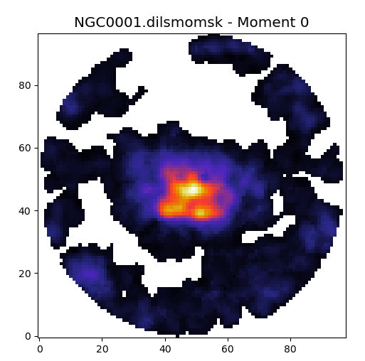

# GBT-EDGE

## Summary

For a background of the science,
see https://greenbankobservatory.org/science/gbt-surveys/edge/

This toolkit helps you reducing the GBT EDGE data.  Installation
requires some attention, as we use a few 3rd party packages that
have their own dependencies.

We also keep all the astrid/summary/tsys logs in this repo.  The raw
data (through session 54) is about 72GB.  This covers
observations from November 5, 2021 (session 1) through April 22, 2024 (session 54)

A very simple example of use: (pick a directory):

      cd /lma1/teuben/GBT-EDGE                                       # at UMD on lma
      cd /home/astro-util/projects/gbt-edge/GBT-EDGE-pipeline        # at GBO on e.g. fourier
      
      source edge.sh                               # this file needs to be created per site
      ./reduce.py -g 1 NGC0001
      ./mmaps.py NGC0001
	  
Each galaxy takes about 10-20 mins to reduce, where the observing time would be
about 60 mins for an Ra and Dec scan.
This is on a fast machine. fourier will take considerably longer.
The use of the **edge.sh** script is optional in your installation, as long as the needed packages are
installed in *your* python (see Installation below). However, at GBO and UMD it is required.

You can push your luck by trying the example maskmoment based **mmaps.py** script which tries a number
of methods to make moment maps.  The run_*sh scripts (see discussion below) automate all of these
commands per galaxy.

Use **reduce.py -h** to get a reminder of the usage. The **gals.pars** file
controls which sessions contain which galaxy

Here is an example of a moment-0 map of NGC0001, produced with mask:moment

## Installation

The source of GBT-EDGE can be downloaded as follows:

      git clone https://github.com/teuben/GBT-EDGE

There are short-cuts in the Makefile, but basically you need to 
install the following python packages in your python3 environment:

* **gbtpipe**: https://github.com/GBTSpectroscopy/gbtpipe
* **degas**:   https://github.com/GBTSpectroscopy/degas
* **maskmoment**:   https://github.com/tonywong94/maskmoment

We use the source based "pip install -e" method,
so you can "git pull" while code updates are being made in those 3rd party packages:

      make git pull
      pip install -e gbtpipe
      pip install -e degas
      pip install -e maskmoment
      pip install pyspeckit
	  
It was noted that python > 3.7 was needed, where GBO runs 3.6.8. I've used the lmtoy/nemo method to
install a container with anaconda3's python, but feel free to use your own
setup, virtual or not.   Also the installation of gbtpipe might need the
bz2 library. On my ubuntu system I needed to install **libbz2-dev** for this to pass the cfitsio
installation that was needed for **gbtpipe**

The Makefile contains a few other targets that may guide you in getting a clean install.

On U22 cfitsio library is now causing a build failure with **gbtpipe** due to bz2

### Python

I use NEMO's install_anaconda3 script.  Newer versions of python have problems.

* python 3.9 is ok,     version=2022.10
* python 3.10 deprecated np.bool (and a few other weird things with curl and matplotlib)
* python 3.11 has deprecated np.bool in numpy 1.20

## Sample Data

Running the calibration off-line is not impossible, but involved, since it needs on-line weather
information. However, using
one of our datasets for [NGC0001](https://www.astro.umd.edu/~teuben/edge/data/NGC0001.tar) can be
used to play with the gridding step, viz.

     make NGC0001
     ./reduce.py -s NGC0001

and skipping the calibration.   If you want to run the calibration, and have downloaded the
GBTWeather data, use

    ./reduce.py -g 1 NGC0001

this also ensures only session 1 is used, in case you have them all.

## Masking

For baseline fitting it is useful to know where the signal is expected. Using the -M flag you can
place a mask file in **masks/mask_GAL.fits**, which should contain 0's, and 1's where we expect signal.
A mask can also be made using the **mk_mask.sh** script (you will need NEMO for this),
documentation is embedded, but here is an
example of use

      ./mk_mask.sh refmap=NGC0776/NGC0776_12CO_rebase3_smooth2_hanning2.fits  \
	               mask=masks/mask_NGC0776.fits  \
	               inc=46 pa=315 vsys=4830 v1=90
      ./reduce.py -M NGC0776
      ./mmaps.py NGC0776

or if you have placed a specific mask file, e.g. masks/mask_NGC0001_Havfield_v1.fits, this would be

      ./reduce.py -m mask_NGC0001_Havfield_v1.fits NGC0776

## Bad Feeds

If there is some indication that some feeds add negatively to the maps, they can be removed at the gridding 
stage, viz.

      ./reduce.py -f 8,11 -M NGC0776

where feeds 8 and 11 (with feed 0 being the first feed) would be removed from gridding. They are still added to
the calibration stage, so one can continue experimenting with pure gridding:

      ./reduce.py -f 11 -s NGC0776
	  
to see what the effect on the final outcome is with just feed 11 removed.

Note we are currently looking into if/why/when feeds 8 and 11 (in the 0-based system), but be aware some users
may use a 1-based system in their language. Internally in the SDFITS files the feeds are numbered 0..15

## Observing

After an observing session you need to edit the **gals.pars** file and add a new galaxy and scan ranges, then
reduce their data and view the resulting fits cube using **ds9** or **carta** for example.

In addition we preserving the *tsys* run of the night, as well as
the *astridlogs*.  For example for session 26 (SEQ=26) this would be:

1. **tsys**:

        ./tsys.py AGBT21B_024_26
        cp pro/AGBT21B_024_26.tsys tsyslogs
        git add tsyslogs/AGBT21B_024_26.tsys
        git commit -m new tsyslogs/AGBT21B_024_26.tsys
        git push

this **tsys.py** script will run IDL scripts,and take a while.

With the Makefile this is reduced to:

        make tsys SEQ=26

2. **astridlogs**:

        cd astridlogs
        getastridlog AGBT21B_024_26
        git add AGBT21B_024_26_log.txt
        git commit -m new AGBT21B_024_26_log.txt
        git push

with the Makefile this is reduced to

        make astrid SEQ=26

## Working with selected sessions

GBT data is organized in sessions, usually starting with 1. In case you have many sessions and want to
reduce one particular session, use the -g flag. But remove the galaxy directory, in case other sessions
had calibrated scans lying around (or rename the directory):

      rm -rf  NGC0776
      ./reduce -g 26,27 NGC0776

## Working Offline

To fully work offline, you will need to create symlinks from
**rawdata** and **weather** to copies of the GBT (sdfits) rawdata and
weather information. The
[degas instructions](https://github.com/GBTSpectroscopy/degas/blob/master/README.md#local-installation-of-the-degas-pipeline)
go in more detail, our **Makefile** has some useful targets to aid in
the setup.

### Example

      wget https://www.astro.umd.edu/~teuben/edge/data/AGBT21B_024_01.tar
      wget https://www.astro.umd.edu/~teuben/edge/data/GBTWeather.tar.gz
      mkdir rawdata
      tar -C rawdata -xvf AGBT21B_024_01.tar
      tar zxf GBTWeather.tar.gz
      export GBTWEATHER=`pwd`/GBTWeather
      ./reduce.py -g 1 NGC0001

the mask file is not here yet.  Note we only use the first session (there are more).

### Nod_Galaxy

Example how to look at Tsys and Nod_Galaxy on NGC5908.  We never really followed up
on this very much. Supporting IDL codes are in the "pro" sub-directory here.
Using GBTIDL use the following commands:

at GBO:

      offline,'AGBT21B_024_14'

true offline:

      filein,'rawdata/AGBT21B_024_14/AGBT21B_024_14.raw.vegas'

after which:

      vanecal,327
      # shows Tsys in range 150-248 (previous RAmap)
      # The NOD has scans 329-334
      vanecal,329
      # shows Tsys in range 184-242 (NOD)
      # fdnum=0..15     1 and 9 are the ones used by us for the nodding - grep for "Nod(source," in astrid logs
      argus_onoff,331,332,329,fdnum=1
      argus_onoff,332,331,329,fdnum=1
      argus_onoff,333,334,329,fdnum=1
      argus_onoff,334,333,329,fdnum=1
      # -> tsys=200
      argus_onoff,331,332,329,fdnum=9
      argus_onoff,332,331,329,fdnum=9
      argus_onoff,333,334,329,fdnum=9
      argus_onoff,334,333,329,fdnum=9
      # -> tsys=203

errors:

      bash: line 1: /users/rmaddale/bin/getForecastValues: No such file or directory
      ->   not at GBO
      ->   weather at  /users/rmaddale/Weather/ArchiveCoeffs
      ->   can't find package Efftcl

We have the following (14) NOD galaxies in the following sessions with the following VANE scan
and starting (26) scans for the NOD

      
      01: IC1683          200              beams 4,7 used in session 1
      01: NGC0001         19
      01: UGC01659        113
      02: NGC0169         14,16            beams 1,9 used in remaining sessions
      02: NGC2253         114,115
      02: NGC2623         377,379
      02: UGC04262        288,290
      03: NGC4047         112,114
      14: NGC5908    329  331,333          nothing visible, strong 0.2K sinisoidal baseline
      17: ARP220     280  282,284
      18: ARP220          378,380
      19: NGC6361         212,214,228,230
      20: NGC5908         193
      21: NGC5908         209,211

## Pipeline

Many ways to do this. One attempt is "make all", which does:

      ./mk_runs.py
      ls ./run_*.sh | awk '{printf("bash %s > %s.log 2>&1\n",$1,$1)}' > runs.sh

and can be followed with

      OMP_NUM_THREADS=1  parallel --jobs 16 < runs.sh

but note the hardcoded hack how to skip sessions 26-31, and flag appropriate beams 2 for various sessions as
defined in mk_runs.py

After this finished, run the stats using "make stats"

      ./do_stats_all > stats.log
      ./mk_summary1.py

this also makes a README.html can be made for viewing

To make the sessions, the run_GALAXY_sessions.sh files have been created,
and will create all sessions/GALAXY__S pipeline directories.

## Caveats/Issues

Some of these issues will be worked on in  the code, and will disappear. See also https://github.com/teuben/GBT-EDGE/issues
Otherwise just be aware of the listed ones here:

1. Although the **-s** can be handy, re-running the **reduce.py** script can be dangerous, as any 
   corrupt files that are in the galaxy working directory, will we wildcarded and taking into the gridding
   step.   In case of doubt, remove the directory before starting a fresh new run.   This also implies you 
   cannot make a differ RA and DEC map without removing all files and perhaps renaming. If you want to make
   separate RA and DEC maps, the gals.pars file will need to have commented out the other map, and the
   
        edit gals.pars
        rm -rf NGC0001
        ./reduce.py NGC0001 ;  mv NGC0001 NGC0001_RA
        edit gals.pars
        ./reduce.py NGC0001 ;  mv NGC0001 NGC0001_DEC
		 
2. Because of the randomized sampler in the PCA methods (i.e., the svd_solver option
   here https://scikit-learn.org/stable/modules/generated/sklearn.decomposition.PCA.html) the results are not reproducable
   on a few mK level.  The solver is highly efficient but can lead to different outcomes.
   
   np.random.seed(123)  doesn't seem to work.

3. A few notes on CPU times: the **-s** flags makes the code run about 2x faster, but always inspect if the galaxy directory
   has the feed files that you expect! Using the weather information make the code
   run maybe 5% slower, not a huge effect. On fourier NGC0001 took about 10 mins, on my i5-1135G7 laptop 4 mins.
   On LMA bruteforce3 took 6:39

4. nProc (see code) doesn't seem to work for me.
   Setting OMP_NUM_THREADS=1 actually seems to make the code run a bit faster and keeps the load to 1-ish
   Using gnu parallel on a machine like lma pays off.

5. For NGC0001 here are some RMS values, for different (beam,hanning) settings

         (2,2)   nomask: 12.6      mask:  8.9mK  ratio 1.4
         (1.3,1) nomask: 33.5      mask: 27.4mK  ratio 1.2
	 
   Going from (1.3,1) -> (2,2) S/N improved by about 3.

6. (in code) it would be useful if buildmasks() could return the mask filename, that we carry it all through

7. The percentage of flagged scans is very low when using a mask, and
   this can be expected as flagging occurs when (1) RMS being too
   high, (2) there being evidence of a large scale ripple in the
   spectrum or (3) there being a big spike in the data.  The mask
   causes the analysis to not check those conditions in the region
   associated with the galaxy.
   
8. The use of the maskfile in griddata() and postprocess.cleansplit() seems not used. This makes the -s useful
   to experiment with the -f flag to remove feeds from the gridding stage.

9. A script "rerun_parallel" has been prepared to allow simple reruns, in particular if you can run them
   in parallel on a bigger machine:

        OMP_NUM_THREADS=1 /usr/bin/time parallel --jobs 16 < rerun_parallel

   this took XX minutes on the "lma" machine for 49 galaxies. Note this assumes the calibration has been run once.=
   so the "-s" flag can be optimally used.
   TBD:    bad beams cannot be edited out without removing the offending feed fits file!
   
   TODO:   we need a "final" script to do everything
    
10. The first 25 sessions were taken with 1.5 x 1.5 arcmin maps and ~33sec integration time per scan.

    Then came session 26, where we experimented with a 1.5x bigger map (in the scan direction only), and
    ~89s integration, which is really too long.

    In session 27 we then changed to 51s (???, or is that the plan)

    Sessions 26-31 are likely all bogus.

11. All 2024/2025 sessions have an incorrect Tcal in vanecal. TWARM was 99. Best is to set
    TWARM = TAMBIENT + 1.5 

## Important Files and Directories

       GBTEDGE.cat   - this should also be in  /home/astro-util/projects/gbt-edge/GBTEDGE.cat 
       night1.py     - a bruteforce example script for Night 1 (Nov 5/6, 2021)
       reduce.py     - reduce one (or more) galaxies, based on parameters in gals.pars
       gals.pars     - galaxy parameter file for reduce.py containing the seq/scans 
       masks/        - here you need to place the mask_GAL.fits file (or symlink) for the -M flag
       rawdata/      - (symlink to) where the GBT rawdata (SDFITS) are stored
       weather/      - (symlink to) where the GBT Weather data (ASCII) are stored (with Coeff*.txt files)
       astridlogs/   - keeps the astrid logs created with "getastridlog"
       tsyslogs/     - keeps the tsys logs created with ./tsys.py

and specific to being at GBT:

       /home/sdfits/AGBT21B_024_01/ - night1 VEGAS raw data directory @ GBO  (1.3GB)
                                      this should be rawdata/AGBT21B_024_01 for a local install

and at lma@UMD:

        /lma1/teuben/GBTRawdata/  - a few cherry picked project (AGBT21B_024, ...)
        /lma1/teuben/GBTWeather/  - usually all the GBO weather database, going back to 2004.
